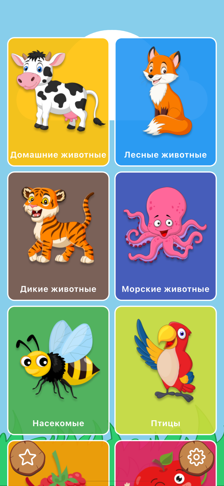
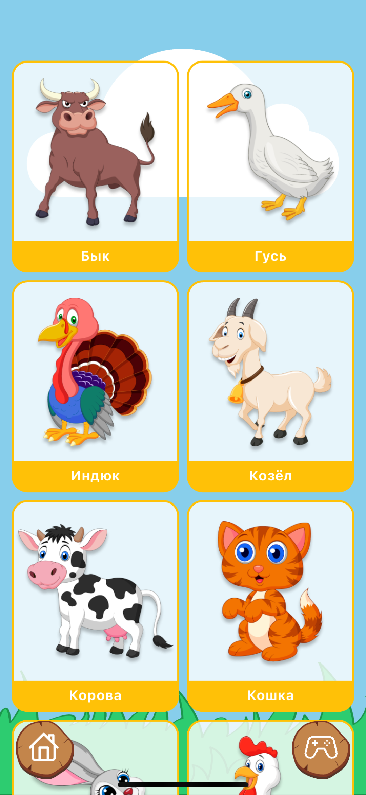
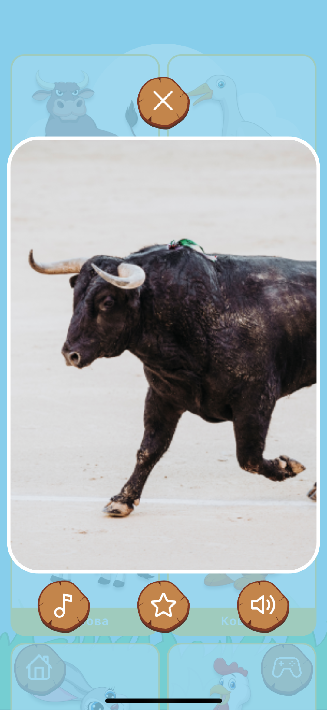
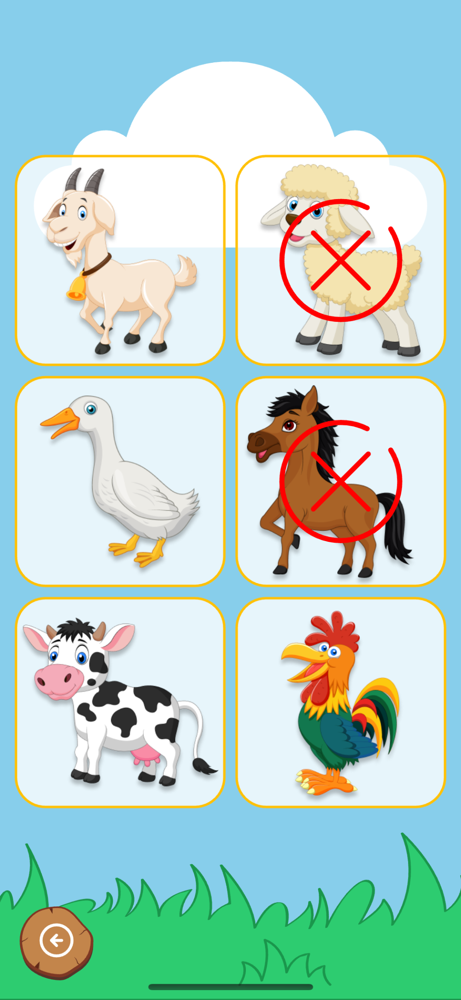

# Карточки для детей

Карточки для детей — обучающее мобильное приложение для детей с интерактивными карточками и озвучкой. Приложение помогает развивать память, внимание и словарный запас через игру и повторение.

## Описание

Карточки для детей — полностью офлайн-приложение, где все изображения, звуки и тексты хранятся локально. Интерфейс адаптирован под детей и поддерживает озвучку категорий и карточек на русском языке. В приложении реализованы мини-игры для проверки знаний.

## Основные возможности

- Просмотр карточек с изображениями и звуковым сопровождением  
- Озвучка категорий и отдельных карточек  
- Мини-игры с проверкой ответов  
- Полная офлайн-работа (все данные хранятся локально)  
- Поддержка локализации и пользовательских настроек  
- Адаптивный дизайн для смартфонов и планшетов  

## Архитектура и стек

Приложение разработано на **Flutter 3.x** с использованием современных инструментов и принципов **Clean Architecture**.

**Технологии:**
- Язык: Dart  
- Архитектура: Clean Architecture (data, domain, presentation)  
- State Management: flutter_bloc, provider  
- Dependency Injection: get_it  
- Routing: go_router  
- Локальная база данных: sqflite  
- Настройки и кэш: shared_preferences  
- Аудио: audioplayers  
- UI: flutter_svg, Material 3  
- Инфраструктура: flutter_launcher_icons, flutter_native_splash  
- Сборка и генерация: build_runner, flutter_lints 

## Структура проекта

lib/
├── data/          # Источники данных 
├── domain/        # Бизнес-логика 
└── presentation/  # UI, состояние 

## Автор
**Максим Макарчук**

[Google Play](https://play.google.com/store/apps/details?id=com.dom.busycards)  
[App Store](https://apps.apple.com/ru/app/%D0%BA%D0%B0%D1%80%D1%82%D0%BE%D1%87%D0%BA%D0%B8-%D0%B4%D0%BB%D1%8F-%D0%BC%D0%B0%D0%BB%D1%8B%D1%88%D0%B5%D0%B9/id6529673021)  
[RuStore](https://www.rustore.ru/catalog/app/com.dom.busycards)

